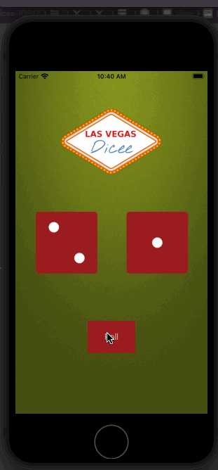
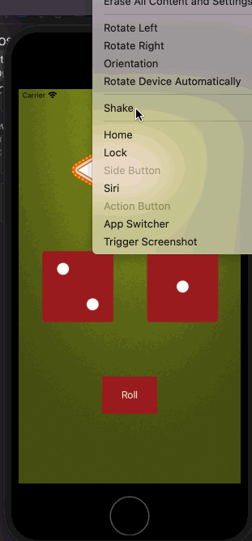

 

# Dicee

## My Goal

The objective of this tutorial is to introduce me to the core programming concepts that I will form the foundation of most of the apps I’ll build in the future. This app will teach me a lot of important programming knowledge, while building a neat dice app.

## What I will create

We’re going to make a Las Vegas dice app. You can make the die roll at the press of a button or by shaking your phone. With this app in your pocket, you’ll be fully set up to settle any score on the go!

## What I will learn

* How to clone an existing Xcode project from GitHub.
* Create an app with behaviour and functionality.
* Create links between the Interface Builder files and code using IBActions and IBOutlets.
* Get familiar with the Xcode code editor.
* * Learn to use comments to annotate code.
* Understand and use Swift constants and variables.
* Understand and use collection types such as Swift arrays.
* Test and debug your app with the Xcode console.
* Learn about randomisation and how to generate random numbers in Swift.

